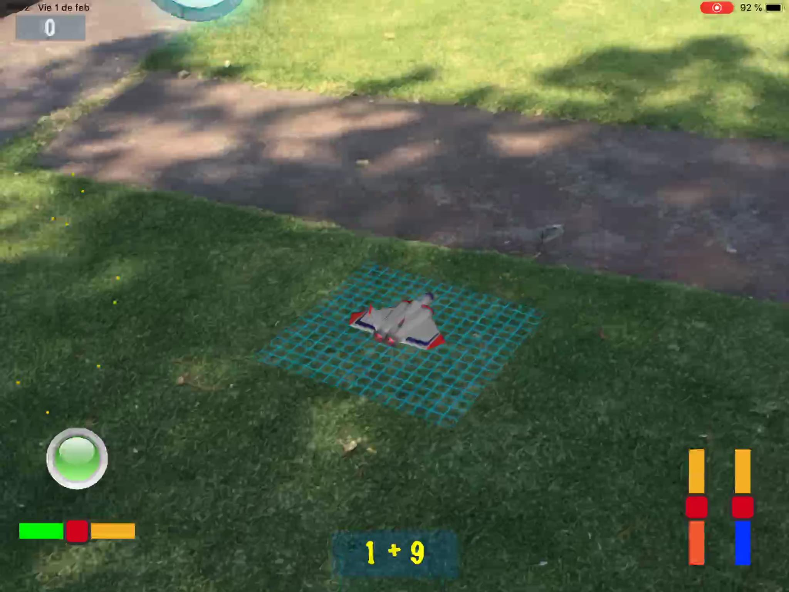
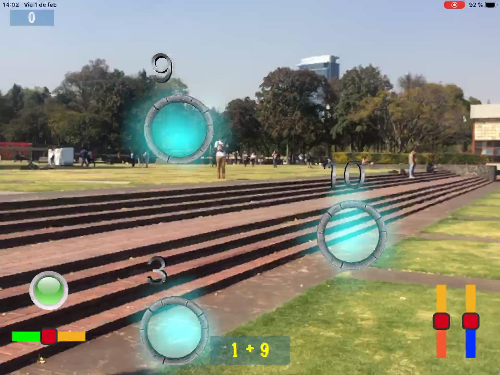
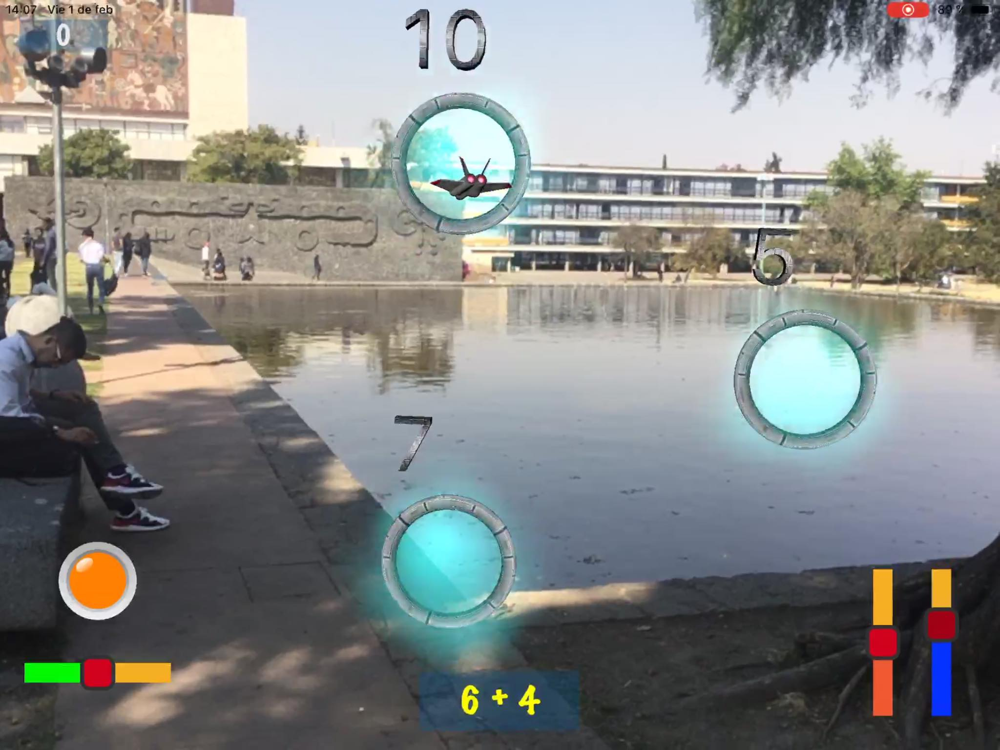
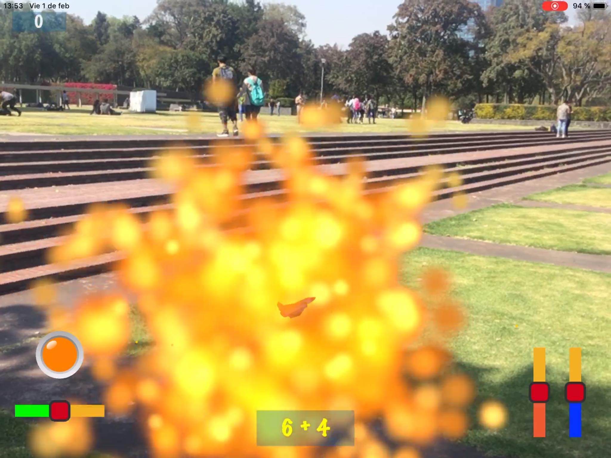
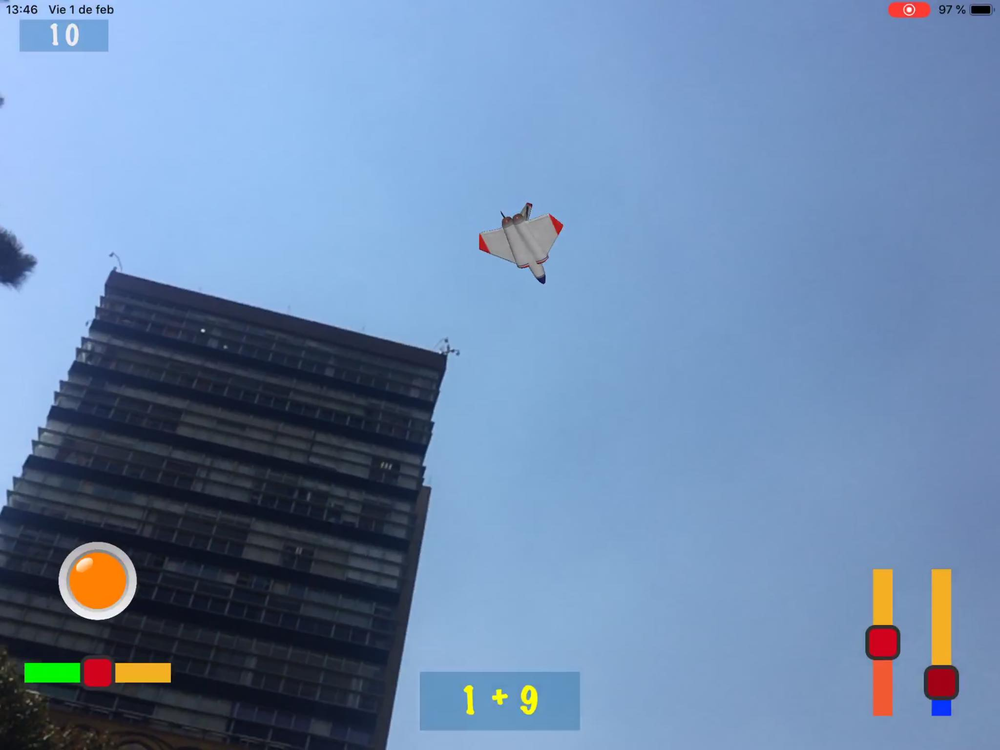

# SumAR
Proyecto final del Diplomado de desarrollo de aplicaciones móviles segunda generación.

Videojuego educativo con el objetivo de enseñar a los niños de primaria a sumar mediante el uso de la realidad aumentada.

